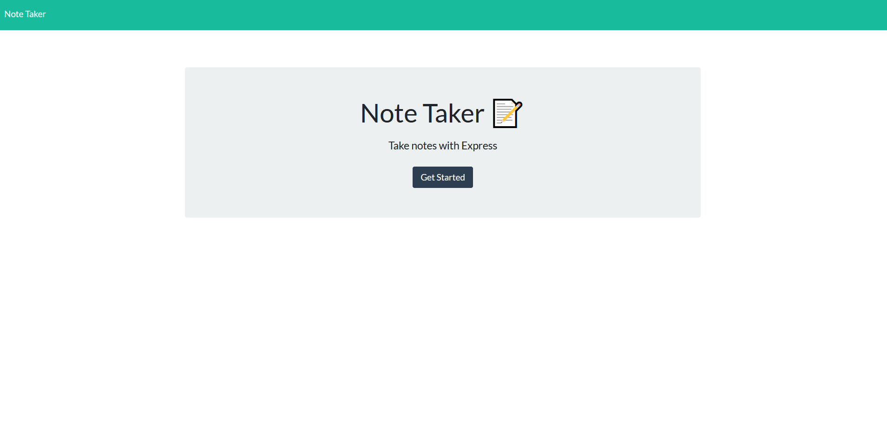
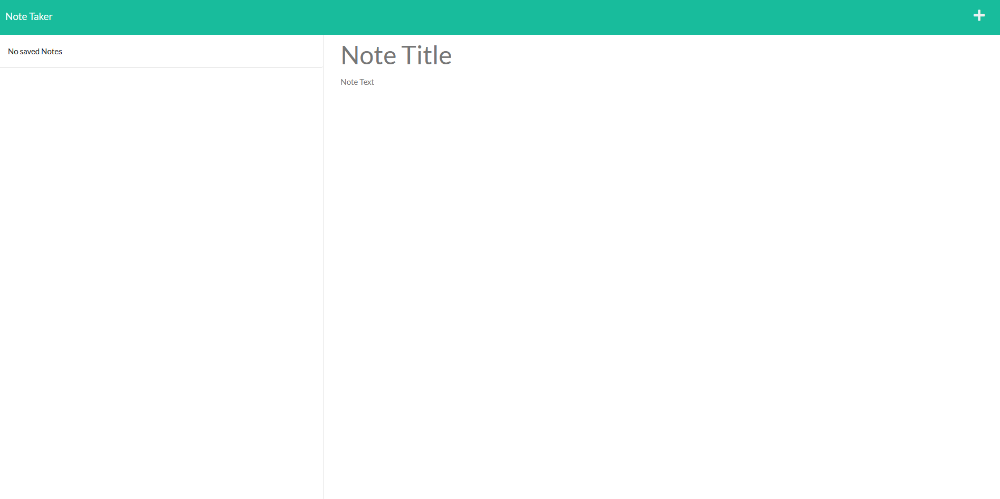

## Challenge Eleven ExpressJS-NoteTaker

### Description
For this weekly challenge, the goal was to build a back end for a note taking app that would allow people to save notes, and have them persist using a server rather than local storage in their browser. This was done using the Node Express package and setting up appropriate GET, POST and DELETE routes for the information to be retrieved, presented, or removed, and updating the existing API data as well. 

The GET routes involved finding and/or displaying the appropriate files/data. The POST route took whatever new information was enterd into the body, added it to the exising data in a JSON format, and then rewrote the file so that information would be accurately displayed. This is also the route where each note was assigned a unique ID based on the length of the array, to then be later used in the DELETE route. Speaking of which, the DELETE route, found the selected note using the ID, and then spliced it out of the file, with the file then being rewritten so the information would be updated on the page. 

### Screenshots
Home/Index Page

Notes Page

### Links
Live Site: [Link](https://loganexpressnotetaker.herokuapp.com/) 
Github: [Link](https://github.com/LoganDufek/ExpressJS-NoteTaker)